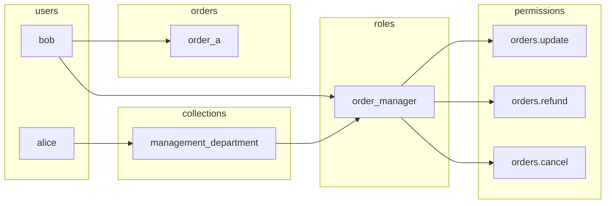

# [WIP] Doorman

My take on simplified access control. Implemented in < 1000 lines of Go.

Essentially just a directed acyclic graph db built on top of Postgres with a few added constraints to enforce good structure and conventions.



## Usage

- Relations
  - Check
  - Create
  - Delete
  - Get
  - List
  - RebuildCache
- Entities
  - Create
  - Delete
  - Get
  - List
  - Update

```go
entities.Create(ctx, entities.CreateRequest{
    Type: "user",
    ID: "dom"
})
```

```go
relations.Create(ctx, relations.CreateRequest{
    From: relations.Entity{ID: "alice", Type: "user"},
    To: relations.Entity{ID: "1", Type: "order"},
    Name: "owner",
})
```

```go
relations.Check(ctx, relations.CheckRequest{
    From: relations.Entity{ID: "alice", Type: "user"},
    To: relations.Entity{ID: "1", Type: "order"},
    Name: "owner",
})
```

TODO: checking access, listing relations by type (index for that first)

TODO: pagination on listing, especially needed when listing by type (to account for possibly millions of members).

TODO: optionally also return dependencies+dependants on relations.Get (maybe also List) if embedding of them is enabled.

TODO: rebuild cache.

## Performance

TODO: some benchmarks, initial test with 100,000,000 relations (1,000,000 users, 1,000,000 resources) and sub ms responses looks good though.

## Custom entities

TODO: explain how custom entity types are supported.
