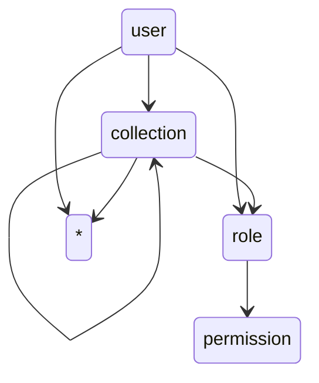

# [WIP] Doorman

My take on simplified access control. Implemented in < 1000 lines.

[](https://asciinema.org/a/3y6N8aJoBnQGHmKb2kn3hkOQl)


## How?

Essentially just a directed acyclic graph with caching.

## Quick Start

```
go get github.com/td0m/doorman/cmd/doorman-server@latest

export PGUSER=doorman
doorman-server
```

### Enforcing structure

Doorman allows you to specify which entities can connect to which.

Let's say you'd like to model the following example:



You can do so via:

```bash
read -d '' DOORMAN_VALID_CONNECTIONS << EOF
[
    ["user", "collection"],
    ["collection", "collection"],
    ["user", "role"],
    ["collection", "role"],
    ["role", "permission"],
    ["user", "*"],
    ["collection", "*"],
]
EOF
```


## Usage

Doorman can be used via one of the following:
 - JSON API
 - gRPC service
 - In-Process Go library

